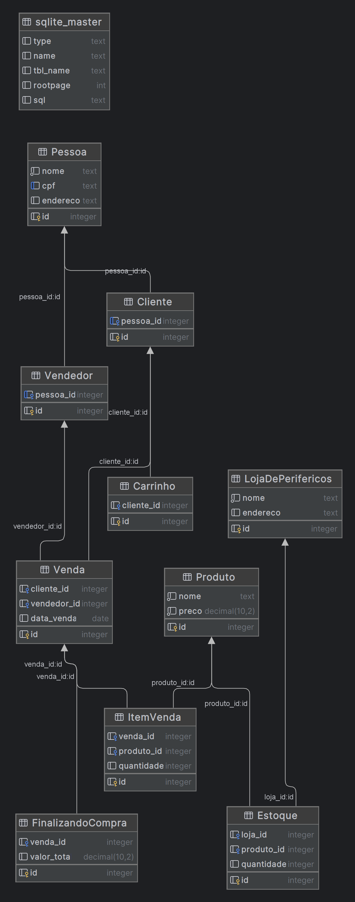

# Sistema de Gerenciamento de Vendas em Loja de Periféricos


## Descrição

Este sistema foi desenvolvido para gerenciar vendas em uma loja de games, oferecendo uma interface intuitiva para clientes e vendedores. Os clientes podem navegar pelos produtos disponíveis, adicionar itens ao carrinho e finalizar compras. Os vendedores têm funcionalidades específicas para registrar vendas e gerenciar o estoque.

## Funcionalidades

- **Visualização de Produtos**: Clientes podem visualizar uma vitrine de produtos organizados por categoria (PlayStation, Xbox, Nintendo).
- **Carrinho de Compras**: Adição de múltiplos produtos ao carrinho com visualização e modificação do conteúdo antes da finalização.
- **Finalização de Compras**: Suporte para múltiplas formas de pagamento, incluindo Pix, Boleto e Cartão de Crédito.
- **Gestão de Vendas**: Vendedores podem registrar vendas e acompanhar o histórico.

## Tecnologias Utilizadas

- **Java**: Linguagem de programação principal.
- **Swing**: Biblioteca gráfica para interface de usuário.
- **SQLite**: Banco de dados relacional para armazenamento dos dados.

## Como Executar

### Pré-requisitos

- **Java JDK 8** ou superior instalado.

### Diagrama de Classe



### Clonar o Repositório

```bash
https://github.com/RainWUV/LojasdeGames/tree/main


